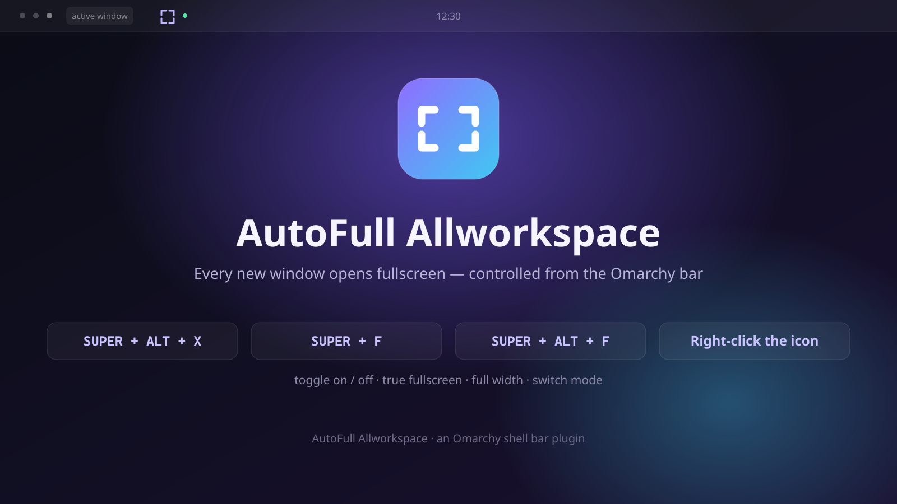

# AutoFull Allworkspace

An [Omarchy](https://omarchy.org) shell **bar plugin** that makes **every new
window open fullscreen**. One icon in the bar, one keyboard shortcut, two
fullscreen flavours.



## Features

- Every newly opened window starts fullscreen.
- Two modes: **true fullscreen** (`SUPER+F`) or **full width / maximized**
  (`SUPER+ALT+F`).
- Toggle on/off from the bar icon or with `SUPER+ALT+X`.
- **Right-click the bar icon** to switch mode.
- Windows already open are adjusted at toggle time; windows opened afterwards
  follow the rule automatically.
- **Does not fight you.** If you manually un-fullscreen a window (`SUPER+F`),
  it stays that way — even across config reloads. Reopen the app, or toggle
  off → on, to expand again.
- State persists across reloads and reboots.

## Install

### From git (recommended)

```bash
omarchy plugin add https://github.com/wisangdg/omarchy-autofull-allworkspace --enable
```

The bar icon appears immediately and works on its own (it uses the script
bundled inside the plugin).

### Add the keyboard shortcut (optional)

Copy the helper onto your `PATH`:

```bash
install -Dm755 ~/.config/omarchy/plugins/wdg.allfull/bin/omarchy-allfull-workspace \
  ~/.local/bin/omarchy-allfull-workspace
```

Add the binding to `~/.config/hypr/bindings.lua`:

```lua
o.bind("SUPER + ALT + X", "AutoFull Allworkspace (toggle)", "omarchy-allfull-workspace")
```

Then reload Hyprland (`hyprctl reload`).

### Manual / development install

```bash
git clone https://github.com/wisangdg/omarchy-autofull-allworkspace \
  ~/.config/omarchy/plugins/wdg.allfull
omarchy plugin enable wdg.allfull
```

## Usage & shortcuts

| Action | Shortcut | Works out of the box |
|---|---|---|
| Toggle on / off | **`SUPER + ALT + X`** | after adding the binding |
| Toggle on / off | **left-click the bar icon** | yes |
| Switch mode | **right-click the bar icon** | yes |
| True fullscreen (mode) | `SUPER + F` | Hyprland default |
| Full width (mode) | `SUPER + ALT + F` | Hyprland default |

The icon is dimmed when AutoFull is **off** and highlighted when it is **on**.
Hover it for a tooltip showing the current state and mode.

## Modes

| Mode | Equivalent | Result |
|---|---|---|
| `maximized` *(default)* | `SUPER+ALT+F` | fills the workspace, bar and gaps stay visible |
| `fullscreen` | `SUPER+F` | true fullscreen, bar hidden |

Switch mode from the icon (right-click) or from the command line:

```bash
omarchy-allfull-workspace mode fullscreen
omarchy-allfull-workspace mode maximized
omarchy-allfull-workspace bar      # print "on:maximized", "off:fullscreen", ...
```

Or edit `~/.config/omarchy/allfull-workspace.conf`:

```
mode=maximized
```

## How it works

The plugin writes a plain Hyprland Lua toggle:

- `~/.local/state/omarchy/toggles/hypr/allfull-workspace.lua` — the window rule
  (`o.window(".*", { maximize = true })` or `{ fullscreen = true }`), which is
  auto-loaded by Omarchy on `hyprctl reload`.
- Enabling writes the rule and expands currently open windows once.
- Disabling removes the rule and clears fullscreen/maximized on every window.
- The rule only ever affects windows opened while it is active; it is never
  re-applied on reload, which is why manual changes stick.

## Files

```
wdg.allfull/
├── manifest.json                 plugin manifest
├── Allfull.qml                   bar widget (icon, tooltip, click handling)
├── bin/omarchy-allfull-workspace toggle + mode CLI
├── preview.png / preview.svg     marketplace preview
├── README.md
└── LICENSE
```

## Uninstall

```bash
omarchy-allfull-workspace off
omarchy plugin remove wdg.allfull
rm -f ~/.local/bin/omarchy-allfull-workspace \
      ~/.config/omarchy/allfull-workspace.conf
```

Then remove the `SUPER + ALT + X` binding from
`~/.config/hypr/bindings.lua`.

## License

MIT — see [LICENSE](LICENSE).
